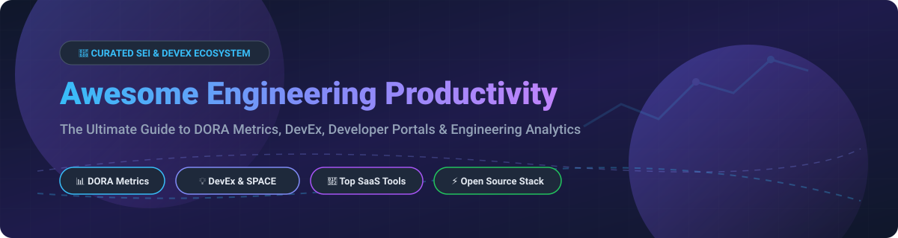

 

# 🚀 Awesome Engineering Productivity Platforms

**A curated list of top SaaS products and open-source projects for Software Engineering Intelligence (SEI), Developer Experience (DevEx), DORA Metrics, and Engineering Analytics.**  

*Last updated: September 2026*

---

## 📌 Executive Summary & Market Insights

Engineering Productivity Platforms empower engineering leaders, platform teams, and developers to eliminate delivery bottlenecks, track key **DORA metrics** (*Deployment Frequency, Lead Time for Changes, Change Failure Rate, Time to Restore Service*), measure developer sentiment using **SPACE & DevEx frameworks**, and optimize engineering investment allocation.

---

## 🏢 SaaS & Hosted Commercial Platforms

### 📈 Market Size & Industry Landscape
> **Market Estimate**: The global **Software Engineering Intelligence (SEI) & Engineering Productivity** market is valued at **~$2.2 Billion** (2026) and is expanding at a **~22% CAGR**.  
> **Market Structure**: The sector is **moderately fragmented**. High-growth enterprise leaders (e.g., *DX / Atlassian*, *Jellyfish*, *LinearB*) command strong enterprise presence, while mid-market vendors and flexible self-hosted open-source alternatives cater to security-conscious and developer-centric teams.

### 📊 Commercial SaaS Comparison Table
*Sorted by Estimated Company Valuation & Market Size (Descending)*

| Platform 🚀 | Est. Valuation / Funding 💰 | Starting Pricing 💵 | Free Tier / Trial Limits 🎁 | Key Focus & Capabilities 🎯 |
| :--- | :--- | :--- | :--- | :--- |
| **[DX (GetDX)](https://getdx.com/)** | **~$1.0B Valuation** *(Acquired by Atlassian)* | **$20 / dev / mo** | **14-day Free Trial** *(Guided demo/pilot up to 25 devs)* | Science-backed DevEx platform combining qualitative developer sentiment surveys (DX Core 4) with quantitative DORA metrics. |
| **[Jellyfish](https://jellyfish.co/)** | **$114.5M Funding** *(~$32M ARR)* | **$30 / dev / mo** | **14-day Enterprise Trial** *(Customized pilot demo)* | Enterprise Engineering Management Platform mapping R&D spend to business outcomes, product themes, and software capitalization. |
| **[LinearB](https://linearb.io/)** | **$71.0M Funding** *(~$25M ARR)* | **$18 / dev / mo** | **Free Forever** *(up to 8 devs)* / 14-day Pro trial | Real-time DORA metrics, PR bottleneck detection, and gitStream workflow automation for engineering teams. |
| **[Code Climate Velocity](https://codeclimate.com/)** | **$66.0M Funding** *(~$15M ARR)* | **$20 / dev / mo** | **14-day Free Trial** *(up to 50 contributors)* | Engineering analytics suite integrating code quality inspection with PR cycle times and delivery health metrics. |
| **[Faros AI](https://www.faros.ai/)** | **$36.0M Funding** *(~$5M ARR)* | **$30 / dev / mo** | **14-day Enterprise Trial** / Free Community Edition | Modular SEI data platform featuring 200+ data source connectors and an open-source self-hosted edition. |
| **[Swarmia](https://www.swarmia.com/)** | **$19.7M Funding** *(~$5M ARR)* | **$15 / dev / mo** | **Free Forever** *(up to 9 devs)* / 14-day trial | Focuses on engineering investment distribution (features vs. tech debt vs. bugs), PR review health, and working agreements. |
| **[Haystack](https://haystackapp.com/)** | **$5.0M Funding** *(~$2.5M ARR)* | **$12 / dev / mo** | **14-day Free Trial** *(unlimited users & metrics)* | Lightweight DORA metrics dashboard offering rapid Git cycle-time analytics and developer burnout prevention. |
| **[Typo](https://typo.ai/)** | **$2.0M Funding** *(~$1.5M ARR)* | **$10 / dev / mo** | **14-day Free Trial** *(up to 15 developers)* | AI-native engineering intelligence platform providing automated code review analytics, DORA metrics, and developer wellbeing insights. |

---

## ⚡ Open-Source GitHub Projects

Open-source engineering productivity tools enable full control over your telemetry, customization via SQL/Grafana, and zero per-developer vendor lock-in.

*Sorted by GitHub Stars_Count (Descending)*

1. 🌟 **[Apache DevLake](https://github.com/apache/devlake)**   
   *Apache-2.0 open-source dev data platform that ingests, analyzes, and visualizes DevOps data from GitHub, GitLab, Jira, Jenkins, BitBucket, SonarQube, and PagerDuty into out-of-the-box Grafana DORA dashboards.*

2. 🔑 **[Four Keys](https://github.com/dora-team/fourkeys)**   
   *Google DORA team's open-source measurement system. Ingests GitHub/GitLab webhooks into Cloud Pub/Sub and BigQuery to calculate the 4 key DORA metrics automatically.*

3. 🛡️ **[Middleware](https://github.com/middlewarehq/middleware)**   
   *Turnkey open-source DORA metrics platform for engineering teams. Automates collection of deployment frequency, lead time, MTTR, and change failure rate with simple Docker deployment.*

4. 📐 **[ThoughtWorks Metrik](https://github.com/thoughtworks/metrik)**   
   *ThoughtWorks open-source measurement tool that extracts data from CD pipelines to calculate DORA metrics across team workflows.*

5. 🛠️ **[DevOpsMetrics](https://github.com/DeveloperMetrics/DevOpsMetrics)**   
   *.NET/C# open-source utility designed to process high-performing DORA DevOps metrics directly from GitHub Actions and Azure DevOps APIs.*

6. ⛵ **[Pelorus](https://github.com/dora-metrics/pelorus)**   
   *Python-based tool from the `dora-metrics` organization, automating the measurement of organizational delivery metrics on Kubernetes & OpenShift.*

7. 🔍 **[Delivery Intel](https://github.com/ParthibanRajasekaran/delivery-intel)**   
   *CLI and web dashboard tool to compute DORA metrics, run vulnerability scans, and calculate health scores for any GitHub repository.*

8. ⚡ **[Dorametrix](https://github.com/mikaelvesavuori/dorametrix)**   
   *Lightweight serverless web service that computes DORA metrics by receiving webhook events from GitHub Actions, Bitbucket Pipes, or custom CI runners.*

9. 🧩 **[Backstage DORA Plugin](https://github.com/liatrio/backstage-dora-plugin)**   
   *Official Liatrio plugin for Spotify Backstage to display team DORA metrics directly inside your internal developer portal.*

10. 🏷️ **[GitHub DORA Metrics](https://github.com/mikaelvesavuori/github-dora-metrics)**   
    *Instant, badge-ready DORA metrics generator designed for automated GitHub repository README displays.*

11. 🔄 **[CDviz](https://github.com/cdviz-dev/cdviz)**   
    *Open-source platform built on CDEvents and Grafana, tracking pipeline health and DORA metrics across GitHub Actions, GitLab CI, and ArgoCD.*

---

## 🤝 How to Contribute

Contributions are welcome! Please follow these simple guidelines:

1. Fork this repository.
2. Update or add new entries to `README.md` (keep descriptions factual and neutral).
3. Ensure SaaS entries include verified starting prices, free tier limits, and company valuation data.
4. Ensure Open-Source entries include a valid stargazers link badge.
5. Submit a pull request with a brief summary of additions!

---

## ☕ Support & Community

If you find this repository helpful, please consider supporting it!

- ⭐ **Star this repository** to help others discover it.
- 🔄 **Fork & Share** it with your engineering team & peers.
- 💖 **Sponsor the Project**: [Buy me a coffee on GitHub Sponsors](https://github.com/sponsors/ishandutta2007)

---

## 📈 Star History

---

## 📄 License

[MIT](LICENSE) © [Ishan Dutta](https://github.com/ishandutta2007)
